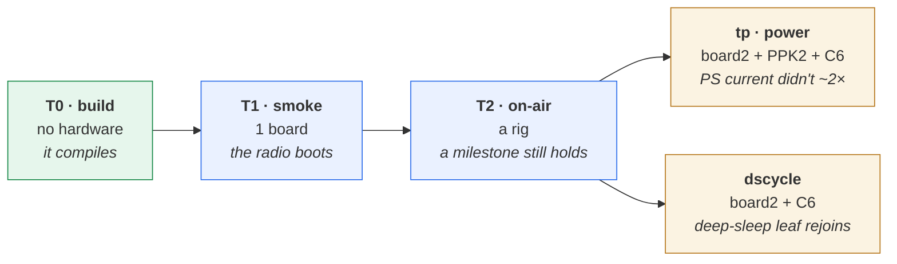
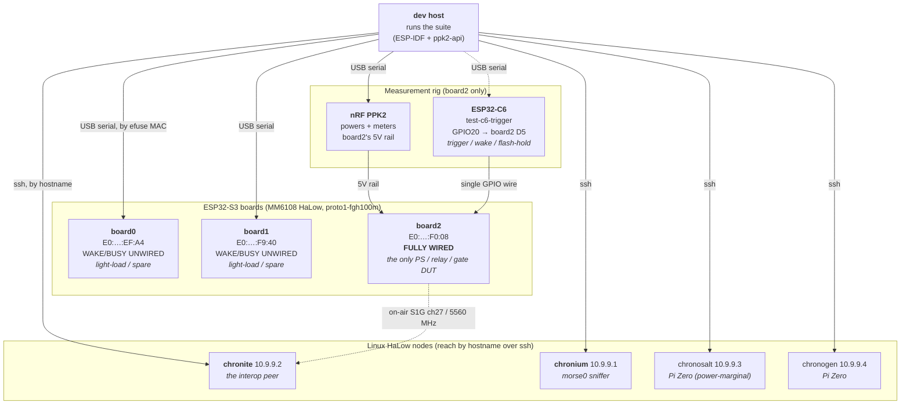
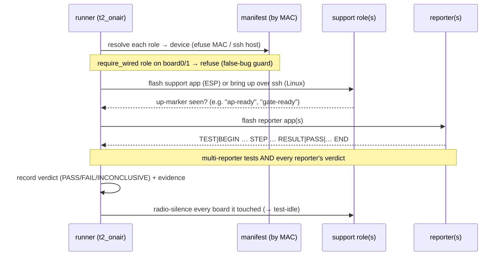
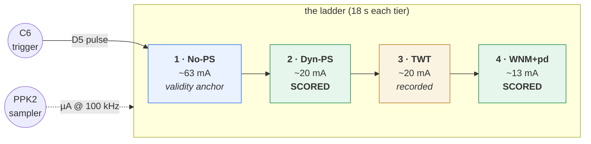

# Rimba regression suite — the complete guide

A detailed, illustrated explanation of the Rimba regression test suite: **what it is, why it
exists, what each test proves (and deliberately does not), and the exact hardware each needs.**

- **This doc** = the *explainer* (concepts + diagrams + device map).
- [`tools/regtest/README.md`](../../tools/regtest/README.md) = the *how-to* (commands, flags, layout).
- [`rimba-regression-results.md`](rimba-regression-results.md) = the *living results* (what the suite
  reports on the current tree, with provenance).

---

## 1. The goal — why this exists

Rimba is ESP32-S3 firmware built on a vendored HaLow stack (`components/halow` = MorseMicro's
morselib + a hostap shim). That stack moves: firmware blobs (`mm6108.bin`), morselib, and ESP-IDF all
get bumped over time, and much of Rimba's code is ported from the Linux reference. **Every bump risks
silently regressing a milestone that worked yesterday** — a dead radio, a broken mesh, a doubled
power-save current.

The suite exists so that after a **stack bump** or a **fork migration**, the question *"is everything
that worked yesterday still working?"* has a **runnable answer** instead of a bench session of
rediscovery.

### The core principle: honest tiers

Every test is explicit about **what it proves and what it does NOT prove.** A test that overclaims is
worse than no test, because it gets trusted. So the suite is split into tiers by *how much hardware
they need* and *how strong a claim they support* — cheap-and-weak first, expensive-and-strong last:



> **Reading the ladder:** cheaper/earlier on the left, more hardware/stronger claims on the right. A
> failure on the left is cheaper to catch than one on the right — the fw-blob check (T0) catches the
> exact power-save regression the `tp` tier exists for, but with *zero* hardware, before a board is
> even flashed.

---

## 2. The tiers, in detail

| Tier | Needs | Proves | Does **NOT** prove |
|---|---|---|---|
| **T0 build** | a laptop | every app × board compiles via `make`, with a real country code + the pinned fw blob | anything at runtime — a T0-green tree can still have a dead radio |
| **T1 smoke** | one board | flash + boot + the radio really comes up (real chip id / fw / MAC / runtime country) | any on-air feature — a T1 board has no peer |
| **T2 on-air** | a real rig | the milestone claims that matter (assoc, IBSS, TWT, mesh, SW-CCMP, the gate…) | throughput / power numbers — those are benchmarks, not pass/fail gates |
| **tp power** | board2 + PPK2 + C6 + an AP | the STA power-save current didn't grossly regress (the fw-1.17.9 ~2× kind) | absolute doze depth — that's a benchmark, deliberately not a gate |
| **dscycle** | board2 + C6 + an AP | the deep-sleep leaf reconnects on every wake | the power number (that's `tp`) |

### T0 — the build matrix

Every app × board compiles through the repo `Makefile` (never bare `idf.py` — the board overlay is
load-bearing), and the generated `sdkconfig` carries a **real country code** (`CONFIG_HALOW_COUNTRY_CODE`,
not `"??"`) and the board's chip target. It also **version-pins the firmware blob**:

- **Why the country code is a T0 check:** morselib refuses to bring the radio up when the country is
  `"??"` (a bare `idf.py` build), returning `MMWLAN_CHANNEL_LIST_NOT_SET` *before* it talks to the
  MM6108 — which looks *exactly* like dead hardware (garbage chip id, MAC `00:00:00`). It's a build-time
  invariant, so it's caught here, with no hardware.
- **The FW-blob version-pin:** T0 asserts `vendor/morse-firmware/firmware/mm6108.bin` is the pinned
  **1.17.8** blob by **size (480664 B) + sha256**. A silent bump to 1.17.9 roughly **doubles** STA
  power-save current — this catches it at the cheapest possible choke point.
- 27 apps on the bench board `proto1-fgh100m`, all green. (The old broken `proto1` overlay was retired.)

### T1 — smoke (flash + boot + radio up)

Flashes each radio app to one board and asserts the radio really came up, reading **values not
line-presence** (a dead radio prints an uninitialised struct):

```
country=US   chip=0x0306   fw=1.17.8   mac=bc:2a:33:96:b2:33   (morselib 2.10.4)
```

The 2 sleep apps are **skipped by default** — a sleep/deep-sleep app powers the ESP32-S3 native USB
down and re-enumerates it constantly, so esptool can never land download mode; recovery needs a PPK2
power-cycle. Run them with `--include-sleep-apps` on board2 only.

**Serial-capture flakes are tolerated, not failed.** board2's PPK2 rail can wobble mid-capture → the
ESP resets and its serial port re-enumerates (renumbered), which pyserial raises as *"device reports
readiness to read but returned no data … multiple access on port?"*. Measured ~2–3 % per capture on
board2 (~0 on bus-powered board0/board1), so `common._capture` catches it once, re-resolves the port by
efuse MAC, and recaptures a fresh window (logged). A persistent fault still FAILs — the retry re-raises
after one attempt, so a genuinely dead board is never masked. (Characterized + hardened 2026-07-18 —
worklog `2026-07-18-bench-stress-and-capture-retry.md`.)

### T2 — on-air feature tests

The milestone claims that actually matter, driven by a **multi-role orchestrator**. Each test declares
*roles* (role → bench device → firmware app, exactly one the **reporter**); the orchestrator resolves
each device by efuse MAC, brings up the support roles, then scrapes the reporter's `TEST|RESULT`
line. See §4–§6.

### tp — the PPK2 power-save tier

A power verdict comes from a **host-side PPK2 current stream the firmware cannot see**, so it's a
separate tier, not a T2 test. It runs a 4-tier current ladder on board2 and gates a *gross* current
regression while always recording the raw mA. See §7.

### dscycle — the deep-sleep reconnect gate

Proves the battery-leaf (`test-deepsleep-cycle`, the dscycle DUT) rejoins the AP on every wake, counting reconnects
across the flapping USB port (the port drops while board2 deep-sleeps and re-enumerates on each wake).

---

## 3. The bench — devices and how they connect



### The devices

| Device | What it is | Role in the suite | Key constraint |
|---|---|---|---|
| **board0** | XIAO ESP32-S3 + MM6108 | light-load endpoint / AP / spare | WAKE+BUSY **unwired** → never a PS/relay/gate DUT |
| **board1** | XIAO ESP32-S3 + MM6108 | light-load endpoint / STA / spare | WAKE+BUSY **unwired** → same |
| **board2** | XIAO ESP32-S3 + MM6108 | **the DUT** for power-save, relay, gate | **only fully-wired board** — the WAKE/BUSY pins are the chip's PS/flow-control handshake; PPK2-powered, so it enumerates **only while `tools/ppk2_hold.py` runs** |
| **nRF PPK2** | Power Profiler Kit II | powers **and** meters board2's 5 V rail (ampere-meter mode) | one control CDC; the `tp`/`dscycle` runner owns it |
| **ESP32-C6** | `firmware/test-c6-trigger` | drives board2's D5 over one GPIO wire — the ladder **trigger**, the deep-sleep **wake**, and the **flash-hold** guard | on `ttyUSB0`; must be powered + flashed + wired |
| **chronite** | Pi 5 + MM6108, Linux | the canonical **interop peer** (real `mac80211` + `morse_driver`); mesh peer or hostapd AP | brought up/down over ssh by `linux_peer.py` |
| **chronium** | Pi + MM6108, Linux | the bench's reliable **morse0 sniffer** (`CONFIG_MORSE_MONITOR=y`) for on-air byte-diffs | not a mesh peer |
| **chronosalt / chronogen** | Pi Zero 2 W + MM6108 | extra Linux mesh peers | chronosalt is power-marginal (reboots on radio-up) |

> **Two rules the harness enforces in code so you don't have to remember them:**
> 1. **Ports are resolved by efuse MAC**, never a cached `ttyACM*` (they re-enumerate on hotplug).
> 2. **board2 is the only PS/relay/gate DUT.** A role marked `require_wired` refuses to run on
>    board0/board1 — using an unwired board there tests missing solder, not code (it has produced
>    false bugs twice).

**Whole-bench invariant:** everything runs **Morse fw 1.17.8**, chip `0x0306`, S1G **channel 27**
(`iw freq 5560`). The T0 fw-blob pin enforces the fw half of this.

---

## 4. How a T2 test runs (the orchestrator)



Every app a T2 test flashes is a self-contained `test-*` app that reports over the **`TEST|`
console contract** (so a human and the scraper never disagree about pass/fail):

```
TEST|BEGIN|name=<slug>|rig=<what this needs>
TEST|INFO|<progress / observed values>
TEST|STEP|<step>|<PASS|FAIL>|<detail>      ← a sub-check
TEST|RESULT|<PASS|FAIL|INCONCLUSIVE>|<detail>
TEST|END|name=<slug>
```

A run that emits **no** RESULT fails — a board that hung or crashed must not read as a pass by silence.

---

## 5. The T2 test catalogue (12 feature tests)

| Test | Rig (role = device) | Proves |
|---|---|---|
| **swccmp** | 1 board, no radio | host SW-CCMP is byte-exact (RFC-3610 KAT) — the crypto mesh MICs interoperate on |
| **ampdu-cap** | board2, mesh vif | the FW still advertises the mesh A-MPDU capability |
| **ap-sta-ping** | ap=board0, sta=board1 | an ESP SoftAP accepts an ESP STA + IP data flows both ways (15/15) |
| **ibss** | board0 + board1 | IBSS join + **exactly-1-peer / 0-phantom** (the divergence-17 fix) |
| **twt** | ap=board0, sta=board1 | mid-session TWT Setup → agreement **INSTALLED** (the action-frame path) |
| **twt-assoc** | linux=chronite (hostapd AP), sta=board1 | **assoc-embedded** TWT → INSTALLED on a real **Linux AP** — the universal path both APs honour |
| **multi-twt** | ap=board0, sta1=board1, sta2=board2 | **2 STAs** both reach TWT INSTALLED concurrently (plain AP) |
| **mesh-peering** | board0 + board1 | SAE + AMPE mesh peering → **ESTAB**, no Linux anchor |
| **mesh-linux** | linux=chronite, esp=board2 | ESP peers + pings a **real Linux mesh node** (the gold-standard interop) |
| **mesh-relay** | origin=board0, **relay=board2**, dest=board1 | mesh multi-hop **SW-CCMP forwarding** through an ESP relay |
| **mesh-ap** | **gate=board2**, mesh_peer=board1, sta=board0 | the **mesh-gate**: mesh + AP on one radio, STA routes through, **ttl=63** (one IP-forward hop) |
| **mesh-ap-multi-twt** | **gate=board2**, sta1=board0, sta2=board1 | the mesh-gate serves **2 concurrent TWT STAs** on its AP half (mesh+AP concurrency + per-STA TWT) |

**TWT coverage as a matrix** (each cell a distinct code path):

|  | single STA | multi-STA |
|---|---|---|
| **plain ESP AP** | `twt` | `multi-twt` |
| **Linux AP** | `twt-assoc` | — |
| **mesh gate** | (implicit in `mesh-ap`) | `mesh-ap-multi-twt` |

---

## 6. The `tp` power-save tier, in detail

board2 runs a fixed **4-tier current ladder**; the **C6 triggers** it; the host **samples the PPK2**
and segments the current stream by the firmware's `TEST|` phase markers.



- **4 tiers measured, 2 scored.** No-PS (~63 mA) is a **validity check** (proves associated + PS on +
  not RX-overloaded); Dyn-PS and WNM+chip-powerdown are the scored discriminators; TWT is recorded (a
  Linux AP ignores the mid-session setup).
- **Wide gross-multiple gate.** Doze *depth* is a benchmark, not a gate — so `PASS ≤ ~1.4×` the
  calibrated 1.17.8 baseline, `FAIL ≥ ~1.8–2×` (the regression direction), `INCONCLUSIVE` in between;
  **raw mA always recorded**; drawing *below* the band is never a FAIL.
- **`tp --light-sleep`** builds a `HOST_LIGHT_SLEEP=1` variant (separate `POWER_BANDS_LS`).
- **Known offset:** this rig reads ~1.6–2× the documented reference on the doze tiers — verified **not**
  an AP-TX / overload issue (both APs + the DUT are already TX-capped to ~0–1 dBm, and the link is
  healthy); an open measurement/config question. The bands are calibrated to *this rig*, so the gate is
  valid regardless.

---

## 7. Status vocabulary

The suite is richer than pass/fail on purpose — conflating an honest non-result with a regression is
how a suite gets ignored:

| Status | Meaning | Gates? |
|---|---|---|
| **PASS / FAIL** | as expected | FAIL gates |
| **SKIP** | could not run (board absent, test not implemented) | no |
| **INCONCLUSIVE** | ran, but the measurement can't be trusted (a noisy RF number, a flaky link) — *not* a code regression | no |
| **XFAIL** | failed, and it was *already known* to fail for a documented reason (a board with a recorded, non-gating breakage) | no |
| **XPASS** | a known-broken case unexpectedly passed → the documented reason is stale | **yes** |

Exit code is **0 only when nothing FAILed** (SKIP / INCONCLUSIVE / XFAIL don't fail the run).

---

## 8. Running it — quick reference

**First, configure your bench** (nothing is stored in the source — `export` once, or append to each
`make` line). The current bench's values are in §3 above / `docs/reference/rimba-bench-devices.md`:

```sh
export BENCH_BOARD=proto1-fgh100m
export BOARD0_MAC=… BOARD1_MAC=… BOARD2_MAC=… WIRED_BOARD=board2
export LINUX_HOST=chronite LINUX_MAC=… LINUX_IP=…    # only the T2 interop tests + tp --ap linux need this
```

Then:

```sh
make test-bench                          # what hardware is present right now (run this first)

make test-all BOARD_NAME=board2 AP=esp CYCLES=2  # EVERY tier in order + report (needs the full rig)

# ...or a tier at a time:
make test-t0                                 # build matrix (no hardware)
make test-t1 BOARD_NAME=board2               # smoke (BOARD_NAME required: board0|board1|board2)
make test-t2                                 # all 12 on-air feature tests (needs the rig)
make test-tp AP=esp                          # PPK2 power-save ladder (AP required: esp|linux)
make test-dscycle CYCLES=2       # deep-sleep reconnect gate (CYCLES required)
make test-tp AP=linux LIGHT_SLEEP=1   # the stronger light-sleep variant
make test-t2 DRY_RUN=1              # the T2 catalogue + rigs, no hardware

make test-report                         # (re)generate build/regtest/report.html
make test-silence                        # return every ESP to the radio-free idle app
```

Each run writes a **git-stamped JSON baseline** to `build/regtest/<tier>-latest.json` (attributable to
an exact tree state — a regression is a JSON diff) and refreshes a self-contained, theme-aware
`build/regtest/report.html`. Long runs can accumulate across kill-safe chunks with `--append`.

**Bench prep:** start `python tools/ppk2_hold.py` before anything using board2 (it powers board2's
rail; board2 enumerates only while it runs). Recover a deep-sleep-wedged board2 with a **5 s** PPK2
power-off (2.5 s leaves it dark) + a tight esptool flash of `test-idle`. Keep the bench radio-silent
after every hardware test — T1/T2/tp auto-flash `test-idle` back.

---

## 9. Where things live

```
tools/regtest/
  run.py          CLI (t0 / t1 / t2 / tp / dscycle / bench / silence / report / flash-interop)
  manifest.py     single source of truth: apps, boards, Linux nodes, known-broken, power bands, fw-pin
  t0_build.py     T0 tier (+ the fw-blob version-pin)
  t1_smoke.py     T1 tier
  t2_tests.py     the T2 catalogue (rigs + expectations + provenance)
  t2_onair.py     T2 orchestrator (roles → devices → TEST| verdict; multi-reporter)
  tp_power.py     the PPK2 power tier
  dscycle.py      the deep-sleep reconnect gate
  linux_peer.py   Linux bring-up over ssh (bring_up_mesh / bring_up_ap / radio_silence)
  common.py       ports, make, serial capture, Result/Reporter, radio-silence
  report.py       the self-contained HTML report
firmware/
  test-common/include/test_report.h   the TEST| verdict contract
  test-<slug>/                            one app per feature + its README
```

**Related reading:** the how-to ([`tools/regtest/README.md`](../../tools/regtest/README.md)); the
results narrative ([`rimba-regression-results.md`](rimba-regression-results.md)); the build-out +
power-tier worklogs ([`2026-07-16-regression-suite-and-fork-migration-plan`](../worklog/2026-07-16-regression-suite-and-fork-migration-plan.md),
[`2026-07-16-ppk2-power-regression-tier`](../worklog/2026-07-16-ppk2-power-regression-tier.md),
[`2026-07-17-powersave-test-cases-batch`](../worklog/2026-07-17-powersave-test-cases-batch.md)).
